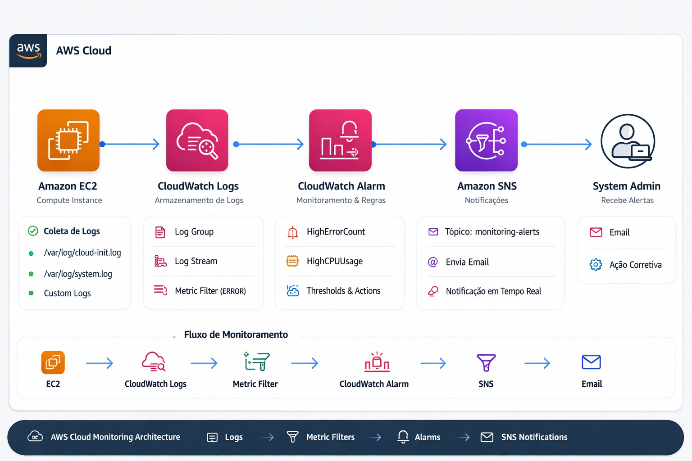

# AWS EC2 Monitoring Lab

Laboratório prático de monitoramento utilizando **Amazon EC2**, **CloudWatch**, **SNS** e um **Dashboard Web** para visualizar alarmes e eventos em tempo real.

Este laboratório demonstra conceitos importantes de **observabilidade em ambientes Cloud**, incluindo:

- Monitoramento de instâncias
- Alarmes do CloudWatch
- Notificações com SNS
- Dashboard de status
- Automação com scripts

---

# Arquitetura do Laboratório



---

# ⚠️ Atenção aos Custos

Este laboratório utiliza recursos da AWS que **podem gerar custos** se não forem removidos após o uso.

| Recurso AWS | Observação |
|-------------|------------|
| EC2 | Utilize instâncias elegíveis ao **Free Tier** |
| CloudWatch | Alarmes podem gerar pequenas cobranças |
| SNS | Envio de notificações pode gerar custo após o Free Tier |
| Armazenamento | Volumes EBS podem permanecer após excluir a instância |

## IMPORTANTE

**NÃO ESQUEÇA de excluir TODOS os recursos criados nesta atividade para evitar custos desnecessários.**

Após concluir o laboratório, remova:

- Instância EC2
- Alarmes do CloudWatch
- Tópicos do SNS
- Volumes EBS
- Roles IAM criadas para o laboratório

---

# Pré-requisitos

Antes de iniciar este laboratório você precisará:

- Conta ativa na AWS
- Acesso ao console da AWS
- Conhecimento básico de Linux
- Conhecimento básico de monitoramento Cloud

---

# Etapa 1 — Criar IAM Role

Crie uma Role chamada:

EC2-CloudWatch-Agent-Role


Anexe as seguintes policies gerenciadas:

- CloudWatchAgentAdminPolicy
- CloudWatchAgentServerPolicy
- CloudWatchReadOnlyAccess
- AmazonEC2ReadOnlyAccess

Essa Role permitirá que a instância consulte informações no **Amazon CloudWatch** e **Amazon EC2**.

---

# Etapa 2 — Criar Instância EC2

Acesse o console do:

Amazon EC2

Crie uma nova instância com as seguintes configurações:

| Configuração | Valor |
|--------------|------|
| AMI | Amazon Linux 2023 |
| Tipo | t2.micro ou t3.micro |
| IAM Role | EC2-CloudWatch-Agent-Role |
| Security Group | Permitir HTTP (porta 80) |

---

# Etapa 3 — User Data

Durante a criação da instância, em:

Advanced Details → User Data


Cole o conteúdo do arquivo:

user-data.sh


Esse script irá automaticamente:

- Instalar Apache
- Instalar Git
- Clonar este repositório
- Publicar as páginas web
- Configurar o script de monitoramento
- Criar atualização automática do status

---

# Etapa 4 — Funcionamento do status.sh

O arquivo:

status.sh


é responsável por coletar informações da instância e dos alarmes do CloudWatch.

Ele consulta:

- ID da instância
- Região
- Availability Zone
- Estado da instância
- Alarmes do CloudWatch

Essas informações são gravadas no arquivo:

status.json


Localizado em:

/var/www/html/status.json


---

# Atualização automática

O script `status.sh` é executado automaticamente via **cron**:

*/1 * * * * /home/ec2-user/status.sh


Ou seja:

**a cada 1 minuto o status da infraestrutura é atualizado.**

## Troubleshooting

Durante a execução do script `status.sh`, foi encontrado um erro de permissão ao tentar gerar o arquivo `status.json`.

### Erro encontrado
/home/ec2-user/status.sh: line 85: /var/www/html/status.json: Permission denied


Esse erro ocorre porque o diretório `/var/www/html` pertence ao usuário `root`, utilizado pelo **Apache HTTP Server**, impedindo que o usuário `ec2-user` escreva arquivos nesse local.

### Solução

Alterar o proprietário do diretório para `ec2-user`:

```bash
sudo chown -R ec2-user:ec2-user /var/www/html

```

Após aplicar a correção, o script pode ser executado normalmente:

ls -l /home/ec2-user/status.sh

/home/ec2-user/status.sh

Resultado esperado

O script gera corretamente o arquivo:

/var/www/html/status.json

---

# Dashboard de Monitoramento

Após iniciar a instância, acesse:

http://IP-DA-EC2


Páginas disponíveis:

| Página | Função |
|------|------|
| index.html | Página inicial do laboratório |
| monitor.html | Dashboard de monitoramento |
| validation.html | Página de validação da atividade |

---

# O Dashboard mostra

Informações em tempo real da instância:

- ID da instância
- Região
- Availability Zone
- Estado da instância

Além disso mostra:

- Alarmes do CloudWatch
- Status de notificações SNS
- Alertas visuais em caso de erro

---

# Fluxo do Laboratório

Criar Instância EC2
↓
User Data instala o ambiente
↓
Dashboard é publicado
↓
Criar Alarmes no CloudWatch
↓
Gerar eventos ou carga
↓
CloudWatch dispara Alarm
↓
SNS envia notificação
↓
Dashboard mostra alerta
↓
Aluno executa ação corretiva


---

# Encerramento do Laboratório

Ao finalizar a atividade, **exclua todos os recursos criados**:

- Instância EC2
- Alarmes do CloudWatch
- Tópicos SNS
- Volumes EBS
- Roles IAM

Isso evita **custos inesperados na sua conta AWS**.

---

# Tecnologias Utilizadas

- Amazon EC2
- Amazon CloudWatch
- Amazon SNS
- Apache HTTP Server
- AWS CLI
- HTML + TailwindCSS

<div align="center">


</div>

### 👨‍🏫 Criado por [Heberton Geovane](https://www.linkedin.com/in/heberton-geovane/)
